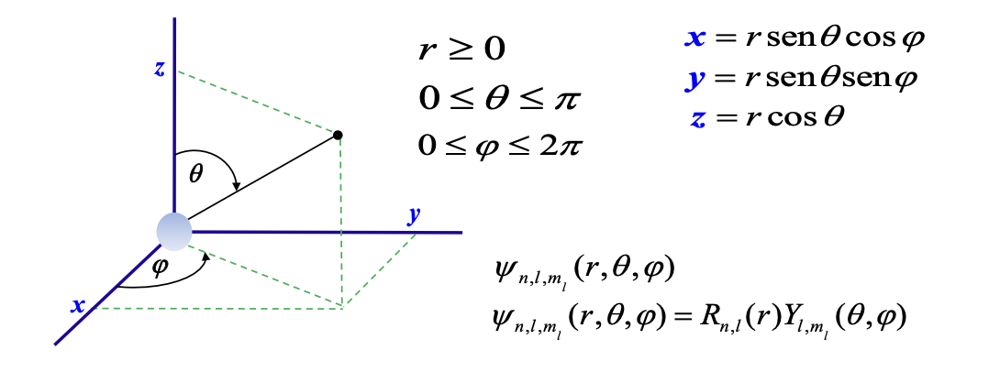
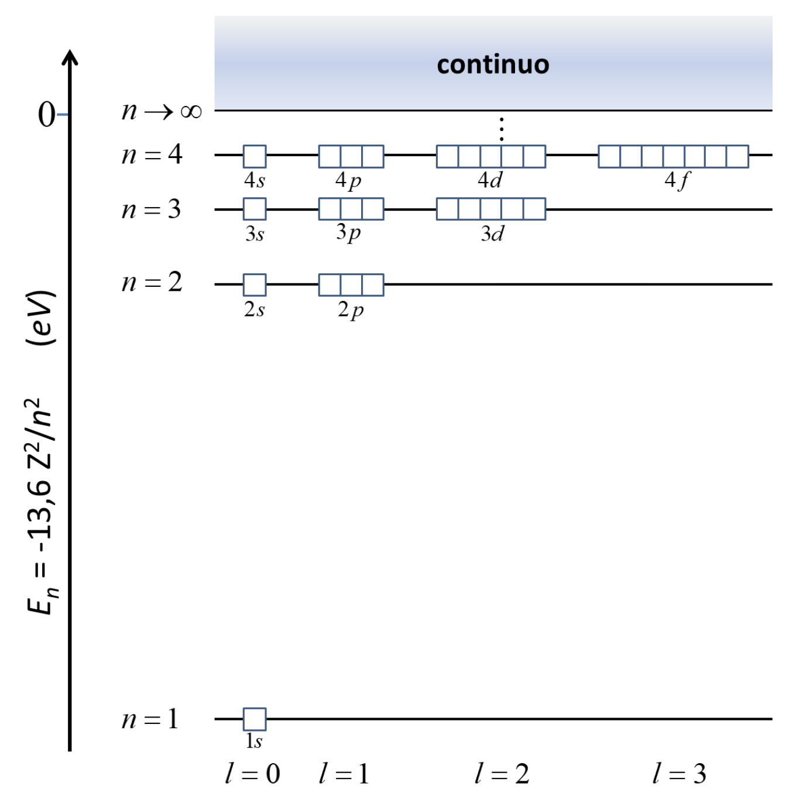
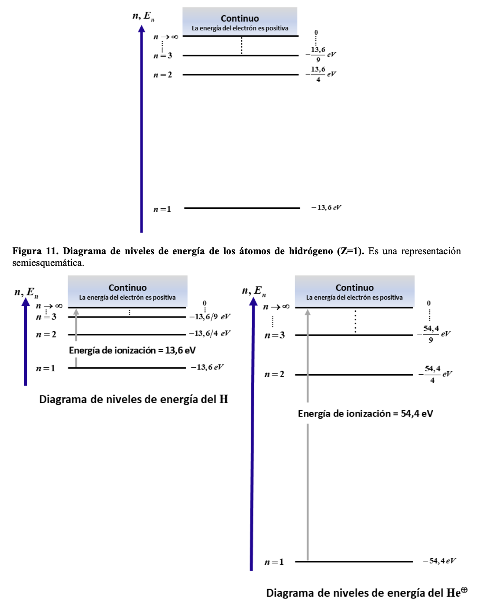
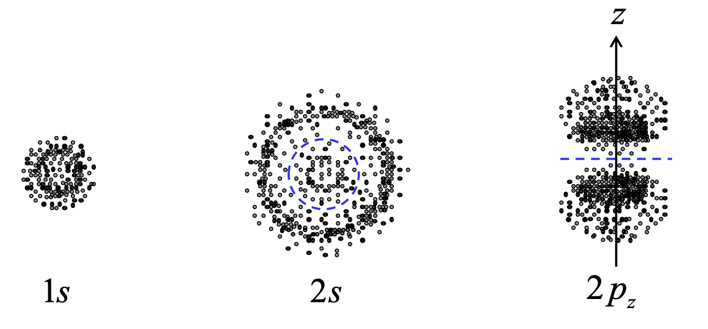

# Cortex Zone of the Atom

Before the rise of quantum physics, all atomic physics was based on:

- Newton's Laws
- James Maxwell's Electromagnetic Equations
- Thermodynamics

Atoms were poorly understood and light was considered a continuous wave.

## Birth of Quantum Physics

## Atomic Models Before Quantum Mechanics

Before, it was thought that atoms were neutral, but with no clear explanation of how positive and negative charges were balanced.

Scientists believed that the atom was:
- Indivisible, small, solid, and indestructible spheres.
- There was no experimental evidence of subatomic particles
- Even though electric phenomena (like static electricity and Maxwell's electric currents) were known, these were not related to atomic structure.

### Thomson's Atomic Model

Thomson's atomic model (1904) was the first to include the discovery of the electron (which he himself identified in 1897). He proposed that an atom is a positively charged sphere with negatively charged electrons embedded within it, like "raisins in a pudding." The positive charge is evenly distributed throughout the atom, balancing the negative charge of the electrons and making the atom neutral overall.

### Rutherford's Atomic Model

To test Thomson's theory, Ernest Rutherford and his team organized an experiment using polonium-210, an unstable and radioactive element, as a source of alpha particles, since it undergoes radioactive decay and transforms into lead-206. 

To generate a narrow and controlled beam, polonium was enclosed in a lead container with a small hole. This hole allowed only the alpha particles emitted in a straight line to pass, forming a beam. The beam moved towards an extremely thin gold foil, chosen because gold can be made ultra-thin without breaking. Around the foil, a fluorescent detection screen coated with zinc sulfide was placed, producing small flashes of light each time an alpha particle struck it. This screen allowed scientists to observe the direction in which the particles scattered after hitting the foil.

Most alpha particles passed through the foil without deflecting. However, some were deflected at small angles, and a very small number were deflected at large angles—even backward. This could not be explained by the plum pudding model. Rutherford concluded that the atom must be made mostly of empty space, with a dense, positively charged center. He called this center the nucleus.

He proposed a model for atoms that have only one electron, **hydrogen-like atoms**, for example: 1-hydrogen, positively ionized helium, doubly positively ionized lithium. There are as many hydrogen-like atoms as there are nuclides, since a neutral atom simply needs to lose all but one electron.

**Planetary model:** Rutherford imagined that the atom was like a miniature solar system:

- The nucleus is like the Sun (positively charged)
- The electron is like a planet, orbiting it in a circular path
- The electron can move at any distance from the nucleus (no defined levels)

Rutherford used Newton's laws and electrostatics to describe the electron's motion. Its total energy consists of:

**Kinetic Energy (K)** — energy of motion

When a particle moves in a circle, it needs a centripetal force to keep it turning toward the center. In this case, that centripetal force is provided by the electrical attraction between the electron (negative) and the nucleus (positive). Both point toward the center.

$F_{\text{centripetal}} = \dfrac{mv^2}{r}$

$F_{\text{electrostatic}} = \dfrac{kZe^2}{r^2}$

$F_{\text{centripetal}} = F_{\text{electrostatic}}$

$\dfrac{mv^2}{r} = \dfrac{kZe^2}{r^2}$

$mv^2 = \dfrac{kZe^2}{r}$

$K = \dfrac{1}{2}mv^2$

$K = \dfrac{1}{2}\cdot\dfrac{kZe^2}{r^2}$ — the electron's kinetic energy

- always positive
- increases when the orbital radius decreases (closer to the nucleus → faster speed)

**Potential Energy (U)** — energy of attraction

Potential energy is defined as zero when the electron is infinitely far from the nucleus  
- When the electron moves closer to the nucleus, its potential energy decreases (more negative)

$U = -k\cdot\dfrac{Ze^2}{r}$

**Total Energy**

$K = - \dfrac{1}{2}\cdot U$

$E = K + U = - \dfrac{1}{2}\cdot U + U = \dfrac{1}{2}\cdot U$

$E < 0$

**$E = -\dfrac{1}{4\pi\varepsilon_0} \cdot \dfrac{Ze^2}{2r}$**

The total energy of the electron is negative, indicating that the electron is bound to the atom.

_As the orbital radius increases: The total energy becomes less negative. It approaches zero from the left, i.e., increasingly negative values approaching zero._

**Limitations**

1. **Atom instability.** An electron in a circular orbit is in constant acceleration (even if its speed does not change, its direction does). According to Maxwell's equations, any accelerated charge emits electromagnetic radiation. That means the electron would lose energy while orbiting. Then the electron should spiral into the nucleus. But atoms are stable, and electrons do not collapse into the nucleus.
2. **Does not explain atomic spectra.** Atoms, like hydrogen, emit light at very specific wavelengths. This produces a line spectrum (not a continuous arc). This means that electrons can only have certain energy values. In Rutherford's model, the electron can orbit at any distance from the nucleus. Then it could have any energy value. That would mean the atom would emit a continuous spectrum, not specific lines.
3. **No defined energy levels** (no quantization). In Rutherford's classical model, there is nothing that limits the electron's orbits. It can have any radius, speed, and energy.
4. **Assumes a fixed nucleus.** The model considers only the electron moving, but in reality, both bodies orbit the center of mass. This is later corrected using the reduced mass.

### Bohr's Atomic Model

Bohr knew Rutherford's limitations and Planck's theory, which introduced the revolutionary idea that energy is quantized, meaning it can only be exchanged in specific, not continuous, values.

**First postulate:** *"As long as an electron moves in a stable orbit around the nucleus, it does not emit radiant energy."*

Bohr introduced this postulate ad hoc (without deriving it from any previous theory), as a special rule for atomic systems.

**Second postulate:** *The electron's orbit length multiplied by its linear momentum must be a positive integer multiple of Planck's constant.*

- Planck (1900) proposed that energy is not emitted continuously but in discrete packets. 
- Einstein (1905) used this idea to explain the photoelectric effect.
- Bohr (1913) extended this idea: he thought that not only energy but also the electron's motion (its angular momentum) was quantized—only certain values are possible.

The electron can only occupy orbits where its angular momentum is a discrete multiple of a fundamental unit. $\dfrac{h}{2\pi}$ is the unit of the orbits.

Angular momentum was chosen to quantize the energy levels—a bridge between classical and modern physics. The electron's rotational behavior around the nucleus is not free to take any value. It is only allowed to have angular momentum in blocks of $\hbar, 2\hbar, 3\hbar$, etc.

According to Bohr, angular momentum must be 

$L = m_e \cdot v \cdot r = n \hbar = \dfrac{nh}{2\pi}$ -> $2\pi r p = n\hbar$

*This was not derived from classical mechanics—it was assumed as a bridge between classical orbits and quantum behavior.*

As in Rutherford's model, the centripetal force keeping the electron in a circular orbit is provided by the Coulomb electrostatic attraction between the electron and the nucleus.

Centripetal force = Electrostatic attraction force: 

$\dfrac{mv^2}{r} = \dfrac{kZe^2}{r^2}$

${mv^2} = \dfrac{kZe^2}{r}$

$L = m \cdot v \cdot r = n \cdot \hbar$ — angular momentum quantization.

$v = \dfrac {n \cdot \hbar}{m \cdot r }$, substitute into the previous equation

$m \cdot \left( \dfrac {n \cdot \hbar}{m \cdot r } \right)^2 = \dfrac{kZe^2}{r}$, solve for $r,\space v,\space E$

$r = \dfrac{n^2 \cdot \hbar^2}{m \cdot k Z e^2}$

For hydrogen, this gives the Bohr radius: $r_1 = 5{,}29 \times 10 ^ {-11} \space m$

$v = \dfrac{k Z e^2}{n \cdot \hbar}$

For hydrogen, $v_1 \approx 2{,}19 \times 10^6 , \text{m/s}$

$E = -\dfrac{m \cdot k^2 \cdot Z^2 \cdot e^4}{2 \cdot n^2 \cdot \hbar^2}$

For hydrogen, $E_1 \approx 13{,}6 \space \text{eV}$

Compact notation:

$r_n = r_1 \cdot n^2$

$v_n = \frac{v_1}{n}$

$E_n = \frac{E_1}{n^2}$

**Third postulate:** *The electron's absorption or emission of energy can only occur by "jumps" from one orbit to another. Transitions between energy levels involve the emission or absorption of photons.*

**Excitation:** An electron can gain energy from the outside — for example, through heat, a collision with another particle, or an electrical discharge.  
If it gains just the right amount of energy, it jumps to a higher orbit — further from the nucleus.  
That orbit corresponds to a higher quantum number. This excited state is unstable — the electron will not stay there forever.

**Emission:** Eventually, the electron falls back to a lower orbit. When it does, it loses energy — but that energy does not simply disappear. It is released in the form of a photon (a light particle). The energy of the photon is equal to the energy difference between the two orbits:
$E_{\text{photon}} = E_{\text{upper}} - E_{\text{lower}}$

Explanation of spectral lines: Each element, especially hydrogen, emits very specific colors of light when excited. These appear as bright lines in a spectrum — we call them emission lines. Before Bohr, no one could explain why those lines were: so precise, repeatable, and why only certain colors appeared.

Bohr's model solved the mystery: Each spectral line corresponds to a specific jump between two orbits. The color (or frequency or wavelength) of light depends on the energy difference between those orbits. Since the energy levels are quantized, so are the colors.

This matched the Balmer-Rydberg formula, an equation discovered experimentally in the 19th century that accurately predicted the hydrogen spectrum, although the physical cause behind it was unknown at the time. Scientists had observed that the wavelengths of emitted light followed a clear mathematical pattern, but did not understand why.

**Limitations:** 

1. **Assumes a fixed nucleus.** In reality, both the electron and the nucleus orbit a shared center of mass. 
2. **Cannot be applied to atoms with more than one electron.** Hydrogen is simple: 1 proton, 1 electron. But helium, lithium, etc., have multiple electrons that repel each other. Bohr's model does not consider those interactions and therefore does not work for most atoms.

### Sommerfeld's Atomic Model

**First valid modification for hydrogen-like atoms:** *the reduced mass*

When two bodies orbit each other, the system behaves as if a single particle with reduced mass orbits a fixed point. Both the electron and the nucleus move: both orbit a shared center of mass. This allows us to treat the nucleus as fixed at the origin of the coordinate system (since it’s much heavier than the electron); analyze the electron’s motion relative to the nucleus, considering the electron’s mass as mu instead of m_e.

The reduced mass is defined as: $\mu = \dfrac{m_e \cdot m_N}{m_e + m_N}$

Therefore, Sommerfeld replaced the mass m in Bohr's equations with the reduced mass $\mu$, and thus modified the formulas for:

Orbital radius: $r_n = \frac{\varepsilon_0 h^2}{\pi \mu e^2 Z} n^2 \qquad (n = 1, 2, \ldots)$

Energy levels: $E_n = -\frac{\mu e^4}{8 \varepsilon_0^2 h^2} \cdot \frac{Z^2}{n^2} \qquad (n = 1, 2, \ldots)$

We define the constant a: $\frac{\varepsilon_0 h^2}{\pi \mu e^2} = a$

Then the orbital radius is: $r_n = \frac{a}{Z} \cdot n^2 \qquad (n = 1, 2, \ldots)$

These equations now depend on the reduced mass, which means:

- The values change slightly depending on the nucleus mass (which varies with each element).
- The energy formula (originally derived by Bohr) also changes:

$E = -13{,}6 \cdot \frac{Z^2}{n^2} \ \text{eV}$

If the nucleus's motion is neglected (limiting case when $m_N \to \infty$), then $\mu \approx m_e$ and the constant $a_0$ is obtained, corresponding to the Bohr radius for hydrogen: $a_0 = 0{,}5292$ Å.

**Second modification:** *elliptical orbits*

Sommerfeld improved Bohr's model by allowing electrons to move in elliptical, not just circular, orbits.

1. Principal quantum number (n) — the electron's energy level or shell in the atom.

2. Azimuthal quantum number (l) — the sublevel or subshell within a given energy level.
  
- For each value of n, there are n possible elliptical orbits.
- (l = 0, 1, 2, ..., n–1)
- *The higher the l, the more circular the orbit. The lower the k, the more elongated the orbit. If l = n–1, the orbit is perfectly circular.*

1. Magnetic quantum number $m_l$ — the spatial orientation of the orbit.

- $m_l = -l, -(l - 1), ..., 0, ..., (l - 1), +l$
- For example, if l = 1 (p orbital), ml can be –1, 0, or +1, corresponding to the three p orbitals oriented in different directions (px, py, pz).
- If l = 2 (d orbital), ml can be –2, –1, 0, +1, or +2, resulting in five d orbitals with different orientations.

**Third modification by Sommerfeld:** *relativistic effects*

Sommerfeld went further by considering a relativistic effect: the mass of the electron slightly increases as its speed increases.

According to relativity: $m = \dfrac{m_0}{\sqrt{1 - \dfrac{v^2}{c^2}}}$

- In circular orbits, the electron's speed is constant, so the relativistic mass is also constant (slightly greater than the rest mass).
- In elliptical orbits, the electron moves faster when closer to the nucleus and slower when farther away. Therefore, its speed and mass change constantly.

Despite these improvements, Sommerfeld's model remained semi-classical and could not explain atoms with more than one electron nor the anomalous Zeeman effect. That is why it was eventually replaced by modern quantum mechanics (Heisenberg, Schrödinger, Dirac...).

# Quantum Mechanics

Classical mechanics deals with motion of large bodies and celestial mechanics, which studies the motion of objects in the sky, like planets and satellites.

By the 1920s, physicists realized that Classical Mechanics could not describe the behavior of small particles (electrons, atoms, molecules).

Key experimental fail: Spectra of lines.

When atoms are heated or excited, they emit light at specific wavelengths, producing discrete lines rather than a continuous spectrum. This phenomenon couldn’t be explained by Classical Mechanics, which predicted that atoms should radiate energy continuously as they orbit, leading to instability.

In the following years, quantum mechanics was developed with concepts such as:
- Quatization of energy, Max Planck
- The photoelectric effect, Albert Einstein
- Bohr’s quantum model of the atom

Collectively, these developments led to the founding of Quantum Mechanics, also known as: wave Mechanics (treats particles as having wave properties).

### Bohr’s Correspondence Principle

At the atomic and molecular levels, we need a new theoretical framework: Quantum Mechanics. But—crucially—Bohr argued that Quantum Mechanics should reduce to Classical Mechanics in the appropriate limit.

*Large quantum numbers: When quantum numbers (e.g., principal quantum number n) become very large, the system behaves more like a classical object.*

Macroscopic bodies: When dealing with macroscopic objects with enormous quantum numbers, Quantum Mechanics’ predictions must match the predictions of Classical Mechanics.

Quantum Mechanics complements Classical Mechanics rather than completely replacing it. 

### Wave-Particle Duality

Definition: The concept that both electromagnetic radiation (e.g. light) and matter (e.g. electrons) can behave like both waves and particles. It emerged from conflicting experimental results in the early 20th century.

Before Einstein, light was thought to be purely a wave. However, Einstein explained the photoelectric effect defining a photon, a particle-like packet (quantum) of electromagnetic radiation. Light can behave like a particle with energy given by:

$E = h \cdot v$

v = frequency, is a characteristic of wave

At the same time, high frequency (even if low energy) light shining on a metal surface can eject electrons from that surface. If the photons' energy is greater than the metal’s work function (the minimum energy needed to free an electron), the electron is ejected.

Extra energy from the photon is given to the electron as kinetic energy.

Wave nature of light: 
- Diffraction: bending of waves around obstacles.
- Interference: overlapping of waves creating patterns of constructive and destructive interference.

Louis de Broglie proposed that if waves can behave like particles, then particles might behave like waves. This means that electrons, protons, neutrons, and even atoms can exhibit wave-like behavior (diffraction and interference).

He introduced the concept of the de Broglie wavelength (matter wavelength): $\lambda = \dfrac{h}{p}$ 

It laid the foundation for Quantum Mechanics: Electrons in atoms are described by *standing* waves around the nucleus (quantization of orbits), that exist if and only if its circumference perfectly aligns with an integer multiple of the electron’s wavelength. If the wave is not stationary (non-integral wavelength), it would interfere destructively with itself, canceling itself out.

Circumference $2\cdot \pi \cdot r = n \cdot \lambda$

(Macroscopic Objects, like a thrown stone, a moving car, have large masses. Even if their speeds are modest, their linear momentum p is huge compared to h, therefore, the Broglie wavelength approaches 0. Their wave-like behavior is undetectable.)

**Connection to Bohr’s Second Postulate:** The electron’s angular momentum is quantized, can only have very descrete whole numbersof specific values, multiples of Plancks constant.

$L = m \cdot v \cdot r = n \cdot \dfrac{h}{2 \pi}$ 

$p = m \cdot v$

$p \cdot r = n \cdot \dfrac{h}{2 \pi}$

$p=\dfrac{n \cdot h}{2\cdot \pi \cdot r}$

$m \cdot v=\dfrac{n \cdot h}{2\cdot \pi \cdot r}$

$m \cdot v \cdot r =\dfrac{n \cdot h}{2\cdot \pi \cdot r}$

$2 \cdot \pi \cdot r \cdot p = n \cdot h$ - this is exactly Bohr’s second postulate: The electron's orbit length multiplied by its linear momentum must be a positive integer multiple of Planck's constant.

**The Electron in a Hydrogen-like Atom (An atom with a single electron orbiting a nucleus)**

According to de Broglie’s theory, the electron is no longer just a particle moving in a classical orbit.

Can be thought of as a wave that surrounds or envelops the nucleus. Instead of having a definite path or position at every instant, the electron’s position is spread out like a cloud.

This wave-like description means that:
- The electron does not have a precisely defined position or trajectory.
- The electron is said to occupy the entire atom simultaneously

*But here’s the twist: in any given experiment, we only see one aspect at a time.*

Electrons also follow diffraction, a key wave phenomenon where a wave bends around corners or spreads out after passing through a small opening. Applies to all waves, as electromagnetic (radio, x-ray) as mechanical (sounds waves, water waves).

*Important Caveat: Wave and particle behaviors don’t appear simultaneously in a single experiment. In an electron diffraction experiment, the electron behaves like a wave (shows interference patterns). In a particle detector, the electron appears as a localized impact—a particle.*

### Heisenberg’s Uncertainty Principle

As experiments became more sophisticated, scientists realized that measuring the properties of a microscopic system (like an electron) always disturbs that system. This is because at the microscopic scale, the act of measuring requires interacting with the particle. Even a single photon can change their momentum or position significantly.

Werner Heisenberg formally stated that it’s impossible to know both the exact position and the exact linear momentum of a particle at the same time.

$\Delta x \cdot \Delta p \geq \frac{\hbar}{2} \quad$

The product of the uncertainty in position and the uncertainty in the momentum is at least equal to reduced Planck's constant. This is a fundamental limit—no matter how perfect the measurement apparatus is.

The uncertainty principle is **not** caused by technological limitations or poor measurement instruments.

Reason: wave-particle duality, measuring one property (like position) precisely spreads out the other property (like momentum).

Measuring position. To measure an electron’s position very precisely, you need to “see” where it is.

The resolving power of a measurement tool (like a photon) is roughly limited by its wavelength—the shorter the wavelength, the better the resolution, $\delta x \approx \lambda$. Hence, to get a small uncertainty in position, you need a short-wavelength probe. But a short-wavelength probe (like a high-energy photon) has a high momentum. When this high-momentum photon interacts with the particle (say, collides with an electron), it transfers momentum to the electron, disturbing its motion and creating uncertainty in its momentum.

*If you use short-wavelength, high-momentum photons to measure position accurately, you disturb the momentum a lot. If you use long-wavelength, low-momentum photons, you don’t disturb the particle’s momentum much, but you can’t pinpoint its position well.*

## Schrödinger’s equation

Mathematical model that helps us figure out where the electron is most likely to be found and what energy it has. 

(Operator acts on a function to produce another function. It is a compact way to say "do something to a function" — like "differentiate" or "multiply by x". Instead of writing the full differential every time, we just write the letter. In quantum mechanics, we often need to apply the same operation (like finding the energy) to different wave functions.)

1. The Hamiltonian operator represents the total energy (kinetic + potential) of the system.
   
   $\hat{H} = - \sum_{i=1}^N \frac{\hbar^2}{2m_i} \nabla_i^2 + V(x_1, y_1, z_1, x_2, y_2, z_2, \ldots, x_N, y_N, z_N, t).$
   
   The first term represents kinetic energy (depends on how the wave function curves in space), involving the Laplacian operators. The second term represents potential energy, which can depend on the positions of the particles and possibly on time.

   $\hat H (r,t)= \hat T (r)+ \hat V(r,t) $

2. The Laplacian is a second-order differential operator that measures how a function curves in space and represents kinetic energy contribution.
   
   $\nabla^2 = \frac{\partial^2}{\partial x^2} + \frac{\partial^2}{\partial y^2} + \frac{\partial^2}{\partial z^2}$

3. Potential Energy V
   
   This is the energy due to the position of particles in the system. 
   
   $V(x_1,y_1,z_1,...x_n, y_n, z_n, t)$ 

   It can be time-dependent or time-independent. If it’s independent of time, the system can be treated as stationary (which is easier to handle).

4. $\psi$ - the wave function. Depends on **position and time**: $\psi(x,y,z,t)$ 
   
   For multiple particles (N particles), psi depends on all their coordinates and time: $\psi(x_1,y_1,z_1,...x_n, y_n, z_n, t)$ 
   
   Although Ψ itself doesn’t have a direct physical interpretation, its modulus squared does: $|\Psi(x,y,z,t)|^2$. If you integrate it over a region of space, you get the probability of finding the particle in that region at that time.

Equation postulate of time dependent Schrödinger Equation:

$$
i\hbar \frac{\partial \Psi (r, t)}{\partial t} = \hat{H} \Psi (r,t)
$$

Interpretation: On the left side we see how the wave function changes over time, on the right side we see that the wave equation is governed by the Hamiltonian.

The time-dependent Schrödinger equation tells you: If you know the initial state of the system at time t=0 (the initial psi), then you can use this equation to predict the system’s state at any later time t. In other words, it is a predictive tool: it describes the dynamics of the quantum system.

The time-independent Schrödinger equation applies to systems where **the potential energy does not depend on time**. $V(x_1,y_1,z_1,...x_n, y_n, z_n)$ . These are called stationary systems. 

We postulate that wave function can be broken down into spatial and time dependencies:

$$\Psi(r,t) = \psi(r) \cdot T(t)$$

By derivation, and substitutind it into the general time-dependent equation, we get the time independent one:

$$\hat{H} \psi = E \psi$$

Mathematically this means: $\hat H$ represents the total energy of the system. $E$ is the allowed energy level of that state.

Physically, solving this equation gives:
- The allowed energy levels of the quantum system.
- The stationary states (wave functions) that correspond to those energies.

*This is where the quantum numbers, energy levels, and orbital shapes come from.*

We also find that :

$T(t) = e^{-iEt/\hbar}$

In the further discussion $T$ will be ignored analyzing stationary states, becuase it does not affect probability density, 

The solutions of $\psi$ must be physically acceptable:
- **Square integrability** over the entire space. This ensures that the total probability of finding the particle(s) somewhere in space is finite — a requirement of any probability distribution.
- **Uniform**: for each set of values $(x_1,y_1,z_1,...x_n, y_n, z_n)$ the function must have one single value. At a given point in configuration space, you shouldn’t get different probabilities by approaching from different directions.
-  **Continuous**: Small changes in the coordinates must produce small changes in $\psi$

### Step by step to analyze a Quantum System

1. Write down the Hamiltonian operator $\hat H$ for the system. This involves identifying the kinetic energy terms (using the Laplacian operators) and the potential energy function. For example, for a single particle in a one-dimensional potential well:
   
   $\hat{H} = - \frac{\hbar^2}{2m} \frac{d^2}{dx^2} + V(x)$

2. Solve the time-independent Schrödinger equation $\hat{H} \psi = E \psi$
3. Find Eigenvalues of E, the allowed energy levels of the system; and Eigenfunctions $\psi$, the corresponding stationary states (the shape of the wave function).
4. Ensure that each $\psi$ satisfies the acceptability criteria
5. Interpret the physical meaning of E and psi:
- the energy levels E tell you what energies the system can have
- the wave functions ψ tell you where particles are likely to be found

## Quantum Model of Hydrogen-like Atoms

In hydrogen-like atoms, both particles move. To simplify calculations, we use reduced mass formula, which converts 2-body problem into 1-body problem. By simpliying the problem, we need only 1 set of coordinates, putting nucleus at (0,0,0) and electron at (x, y, z). We no longer use $(x_1, y_1, z_1, x_2, y_2, z_2)$. The wave function and the energy of the electron are obtained by solving the time-independent Schrödinger equation for this system.

$$\hat H \psi (x ,y, z)= E \psi (x ,y, z)$$

The Hamilton operator becomes :

$$
\hat{H} = -\frac{\hbar^2}{2\mu} (\frac{\partial^2}{\partial x^2} + \frac{\partial^2}{\partial y^2} + \frac{\partial^2}{\partial z^2}) - \frac{Ze^2}{4\pi \varepsilon_0 r}
$$

$r = \sqrt{x^2 + y^2+z^2}$

The time-independent Schrödinger equation for the hydrogen-like atom:

$$
\left[ -\frac{\hbar^2}{2\mu} \left( \frac{\partial^2}{\partial x^2} + \frac{\partial^2}{\partial y^2} + \frac{\partial^2}{\partial z^2} \right) - \frac{Ze^2}{4\pi \varepsilon_0 r} \right] \psi(x,y,z) = E \psi(x,y,z).
$$

The potential energy in the **hydrogen-like atom only** depends on the distance r. No matter which direction you measure from the nucleus (positive x, negative y, etc.), the potential is the same as long as the distance is the same. If there are more than 1 electron, the system becomes more complex, since there we must account for repulsion between electrons. It will depend also on the angles and distances between all the electrons.

For **hydrogen-like atom only**:

$$V = - \frac{Ze^2}{4\pi \varepsilon_0 r}$$

We use spherical coordinates to describe electron's position. 

$r$ - distance from the origin.

$\theta$ - angle with the positive x-axis measured towards positive y-axis

$\phi$ - angle from the positive z-axis

Relationship with cortesian coordinates:

- $x = r \space sin \theta \space cos \phi$

- $y = r \space sin \theta \space sin \phi$

- $z = r \space cos \phi$ 

Theta and phi describe the direction, but don’t complicate the potential term.

Because the potential energy in the hydrogen atom depends only on r (distance from the nucleus), the equation can be split into parts that depend on r, θ, and ϕ separately. 

$\psi(r, \theta, \phi) = R(r)Y(\theta, \phi)$

$R$ describes how the wave function changes with distance from the nucleus (how likely it is to find the electron at different radii).

$Y$ describes how the wave function depends on direction (what shape the orbital has).

### Quantum Numbers

Each orbital is labeled using three quantum numbers.

The radial part $R_{n} (r)$ correcponds to the **principal quantum number n**, which determines the size and energy of the orbital. This function describes how the probability density varies with distance from the nucleus. It is always real and shows nodes—regions where the probability density goes to zero.

It is given by:

$$E_n = -\dfrac{\mu  Z^2 e^4}{8\varepsilon_0^2 h^2 n^2}$$

- The electron is in a bound state — it cannot escape the attraction of the nucleus unless energy is added.
- Energy increases (gets closer to 0 from the left) as n increases.
- For hydrogen-like atoms, energy depends only on n, not on l or ml.

Approximate expression:

$$E_n \approx - \dfrac{13,6 eV \cdot Z^2}{n^2}$$

The angular part $Y_{l,m_l}$ s called a spherical harmonic and depends on: 
1. Angular momentum (or azimuthal number) l. l = 0,1,2...n-1 ⇾ shape of the orbital. 
   
   For l = 0 (s): ml = 0 → 1 orbital
   
   For l = 1 (p): ml = –1, 0, +1 → 3 orbitals
   
   For l = 2 (d): ml = –2, –1, 0, +1, +2 → 5 orbitals
   
   For l = 3 (f): ml = –3, –2, –1, 0, +1, +2, +3 → 7 orbitals

2. Magnetic quantum number $m_l$ - orientation of the orbital in space. It tells us how many orbitals there are of each type l in a given energy level.

   If $l = 2, m_l = -2,-1,0,1,2.$

   $\psi_{n,l,m}(r,\theta,\varphi) = R_{n,l}(r) \cdot Y_{l,m}(\theta,\varphi)$

### Real vs. Complex Orbitals

For ml ≠ 0, the solutions in θ and ϕ are complex functions (they have i’s in them). Chemists usually prefer real orbitals—often constructed by combining complex solutions (to match experimental observations). We can combine pairs of complex solutions with the same quantum numbers (n, l, and |ml|), but opposite ml values (e.g. +1 and -1), to make real functions. To get real orbitals, we combine pairs of complex solutions with opposite ml values. 

### Degeneracy 

Phenomena when multiple states (wave functions) share the same energy.

Even though the wave functions themselves (orbitals) depend on all three quantum numbers (n, l, ml), the energy comes out to depend only on n. For a given value of n, different combinations of l and ml describe different spatial shapes and orientations of the orbitals—but all have the same energy.

This means:

n=1

1s (n=1, l=0, ml=0) — unique: no degeneracy beyond spin (which we’re ignoring here).

n=2:

2s (n=2, l=0, ml=0)

2p (n=2, l=1, ml=–1, 0, +1)

All of these five states (1 from 2s + 3 from 2p) have the same energy.

n=3:

3s (l=0, ml=0)

3p (l=1, ml=–1,0,+1)

3d (l=2, ml=–2,–1,0,1,2)

All of these nine states (1+3+5=9) have the same energy.

Degeneracy of an energy level is $n^2$

However—this is crucial—in multielectronic atoms, like most real atoms with more than one electron, this degeneracy breaks because of electron-electron interactions and shielding effects

### Energy level Diagrams

Ground state - the lowest possible energy state of the atom, which occurs when the principal quantum number n = 1. This is the most stable state—any higher energy state corresponds to an excited state.

The ground state energy of a hydrogen-like atom is given by:
$E_1 = -13,6 Z^2 eV$

Ionization energy - is the minimum energy required to remove the electron completely from the atom, to bring energy to 0.

In the hydrogen case, $IZ = 13,6 eV$

Higher Z means a stronger Coulomb attraction between the electron and nucleus, therefore more energy is required to overcome this attraction and free the electron.

State gaseoso: the atom is isolated—no interactions with other atoms that might lower the energy needed to remove the electron.

Sublevel

### Electron point representation

For real orbitals (as the textbook focuses on), the probability density is given by $\psi^2$. The point representation method consists of plotting a collection of points around the nucleus, with the number of points at each location proportional to the probability density $\psi^2$ at that point.

A nodal surface is a region in space where the probability density is zero — meaning the electron cannot be found there.

Spherical nodal surfaces appear in s-type and some higher orbitals. They are spheres centered on the nucleus. For example, in the 2s orbital, there is one spherical nodal surface. Spherical surfaces depend on n (principal quantum number).

Planar nodal surfaces appear in p, d, and other orbitals. They are planes (or sometimes cones, as mentioned in other sections). For example, in the 2pz orbital, there is one planar nodal surface passing through the nucleus.

Some orbitals can have both spherical and planar nodal surfaces, depending on their quantum numbers. Planar surfaces depend on l (angular momentum quantum number).

As n increases, the number of spherical nodal surfaces increases. The number of planar nodal surfaces equals l. If l is even, the orbital is symmetric with respect to the origin. If l is odd, the orbital is antisymmetric. Orientation of the orbital in space: How the shape of the orbital is aligned along the coordinate axes.

For example: In p orbitals, ml = –1, 0, +1 corresponds to px, py, and pz orientations.

### Electron Spin

The spin quantum number (s) for an electron is always 1/2 — a fixed value by nature.

The spin projection quantum number (ms) can be:

+1/2 (spin “up”) or ALPHA

–1/2 (spin “down”) or BETA

These values define the projection of spin angular momentum along the z-axis, similar to how ml defines the projection of orbital angular momentum.

The total number of states per principal quantum number n is now: 2n^2

This doubling is essential for:

- Explaining why each orbital can hold two electrons (one with spin up, one with spin down).

- Understanding the Pauli exclusion principle: no two electrons can have the same set of all four quantum numbers (n, l, ml, ms).

